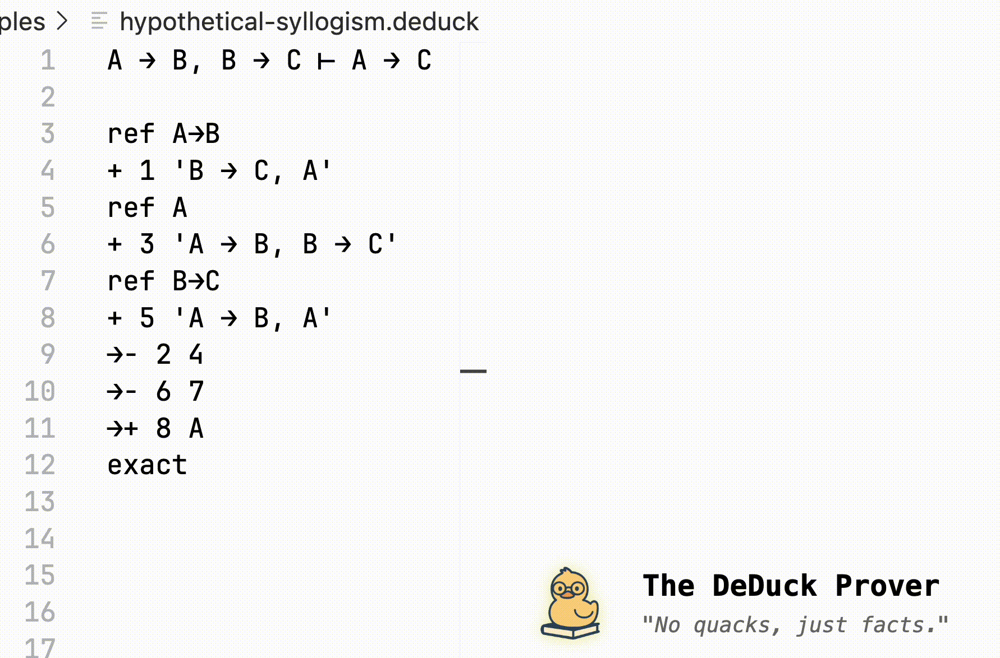

# VS Code Extension for the DeDuck Prover



[DeDuck](https://github.com/deduck-prover/deduck) is a little prover designed for CS 245 (Logic and Computation) taught at the University of Waterloo. This Visual Studio Code extension provides a simple interface for interactively programming and checking proofs in a first-order logic system using the DeDuck prover.

The Python package `deduck-prover` is required to use this extension. It can be installed by running the following command:

```bash
pip install deduck-prover
```